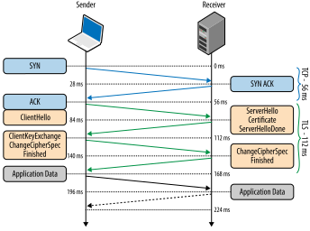
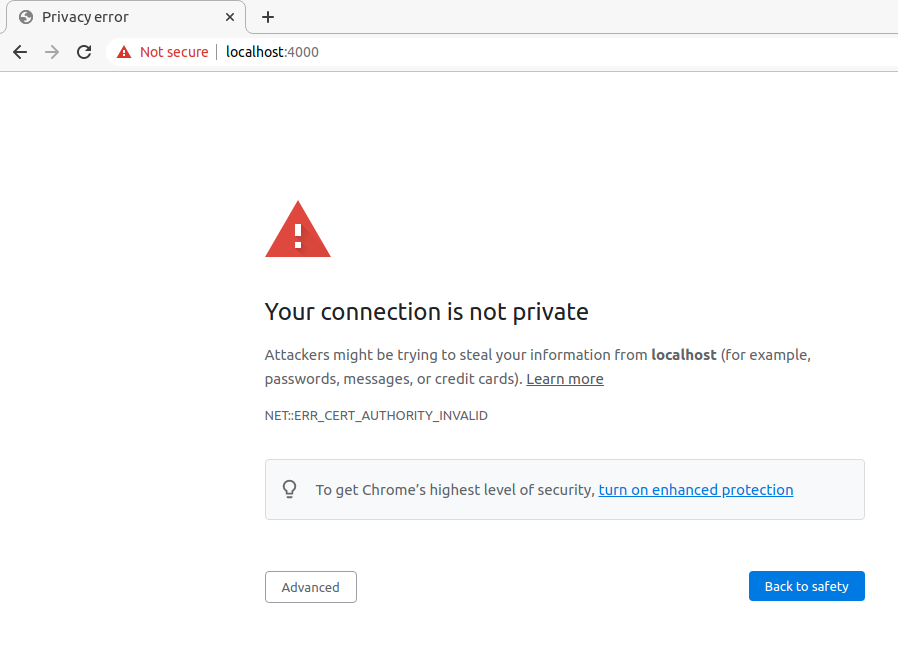
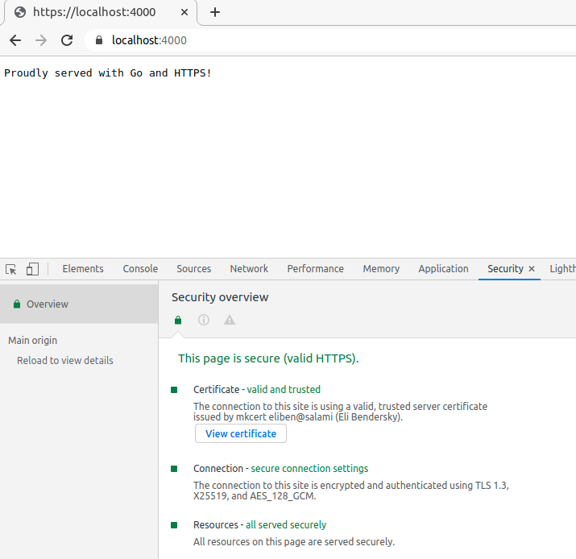

# Go HTTPS servers với TLS.

Bài post này là một bài giới thiệu cơ bản về cách sử dụng TLS để chạy HTTPS server và client trong Go. Hãy tham khảo các bài viết về [RSA](https://eli.thegreenplace.net/2019/rsa-theory-and-implementation/) và [Diffie-Hellman Key Exchange](https://eli.thegreenplace.net/2019/diffie-hellman-key-exchange/); TLS sử dụng phiên bản elliptic-curve của Diffie-Hellman.

Bạn có thể tham khảo code cho bài viết này [tại đây](https://github.com/ducnguyen96/ducnguyen96.github.io/tree/master/static/code/blog/tls).

## Giới thiệu ngắn gọn về TLS

TLS (Transport Layer Security) là một giao thức được thiết kế để cho phép giao tiếp client-server qua Internet một cách an toàn, ngăn chặn việc nghe trộm, can thiệp và giả mạo tin nhắn. Nó được mô tả trong [RFC 8446](https://tools.ietf.org/html/rfc8446).

TLS dựa trên kỹ thuật mật mã tiên tiến; đây cũng là lý do tại sao nên sử dụng phiên bản mới nhất của TLS, phiên bản 1.3 (vào cuối năm 2023). Các phiên bản của TLS sẽ loại bỏ các trường hợp có thể không an toàn, loại bỏ các thuật toán mã hóa yếu và nói chung cố gắng làm cho giao thức an toàn hơn.

Khi một client kết nối tới một server với HTTP thì nó sẽ bắt đầu gửi dữ liệu dưới dạng text được bọc trong các gói TCP ngay sau khi hoàn thành TCP handshake (SYN -> SYN-ACK -> ACK). Sử dụng TLS thì quá trình trên sẽ phức tạp hơn một chút [^1]:

TCP handshake:

- Client gửi một TCP package với SYN(Synchronize) flag tới server để mờ đầu quá trình thiết lập kết nối
- Server nhận được gói tin và gửi lại một gói tin SYN-ACK (Synchronize-Acknowledgement) để xác nhận rằng nó đã nhận được gói tin của client.
- Client nhận được gói tin SYN-ACK và gửi lại một gói tin ACK để xác nhận rằng nó đã nhận được gói tin của server.

<div align="center" style={{"backgroundColor": "white"}}>
  
</div>

Sau khi hoàn thành TCP handshake, server và client sẽ bắt đầu thực hiện TLS handshake để đồng thuận về các thông số bảo mật cũng như trao đổi key(key này thì unique và chỉ áp dụng trong session này)
. Key này sẽ được sử dụng để mã hóa dữ liệu được trao đổi giữa server và client. Quá trình này khức tạp nhưng may mắn là đã có TLS layer lo, chúng ta chỉ cần cài đặt TLS server (hoặc client); sự khác biệt giữa một HTTP server và một HTTPS server trong Go là rất nhỏ.

## TLS certificates

Trước khi chúng ta đi vào code để tạo một HTTPS server trong Go sử dụng TLS, hãy nói về _certificates_. Trong hình vẽ ở trên, bạn sẽ thấy rằng server gửi một certificate tới client như là một phần của _ServerHello_ message. Chính xác thì chúng được gọi là X.509 certificates, được mô tả trong [RFC 5280](https://tools.ietf.org/html/rfc5280).

Việc mã hóa public key đóng một vai trò quan trọng trong TLS. Sử dụng ceritifcate là một cách chuẩn để bọc public key của server, cùng với định danh của nó và một chữ ký của một trusted authority(có thể hiểu là một bên khác có thẩm quyền, đáng tin cậy như Let's Encrypt, GoDaddy, DigiCert, IdenTrust, ...) - xem thêm [ở đây](https://en.wikipedia.org/wiki/Certificate_authority). Giả sử bạn muốn trao đổi thông tin với https://bigbank.com; làm sao bạn có thể chắc chắn là Big Bank real đang hỏi password của bạn, nếu như có ai khác ở giữa giả vờ là Big Bank (classical MITM - man-in-the-middle attack) thì sao?

Certificates được thiết kế để giải quyết vấn đề này. Khi một client kết nối tới https://bigbank.com có sử dụng TLS, nó sẽ expect certificate của Big Bank với public key, được ký bởi một certificate authority (CA) được tin tưởng. Các chữ ký trên certificates có thể là 1 chuỗi (key của bank được ký bởi A, A được ký bởi B, B được ký bởi C,...), nhưng ở cuối chuỗi thì nó phải có một certificate authority được tin tưởng bởi client. Các trình duyệt hiện đại có một danh sách các CA được tin tưởng (cùng với các certificate của chúng) được tích hợp sẵn. Vì vậy, dù có bắt được request của bạn thì kẻ đó cũng không thể giả mạo chữ ký của một certificate được tin tưởng, không thể giả mạo Big Bank.

## Generating self-signed certificates in Go

Để test thì ta việc sử dụng các with self-signed certificates cũng rất hữu ích. Một self-signed certificate là một certificate cho một entity E với public key P, nhưng key này không được ký bởi một trusted CA, mà được ký bởi chính P. Mặc dù self-signed certificates có một vài ứng dụng, nhưng chúng ta chỉ nên sử dụng chúng cho testing.

Trong Go, thư viện chuẩn có hỗ trợ tốt cho mọi thứ liên quan đến crypto, TLS và certificates. Hãy xem cách tạo một self-signed certificate trong Go!

```go
privateKey, err := ecdsa.GenerateKey(elliptic.P256(), rand.Reader)
if err != nil {
  log.Fatalf("Failed to generate private key: %v", err)
}
```

Đoạn code này sử dụng `crypto/ecdsa`, `crypto/elliptic` và `crypto/rand` packages để gen một cặp key mới[^2], sử dụng elliptic curve P-256, đây là một trong những elliptic curve được cho phép
trong TLS 1.3.

Tiếp theo, ta sẽ tạo một _certificate template_:

```go
serialNumberLimit := new(big.Int).Lsh(big.NewInt(1), 128)
serialNumber, err := rand.Int(rand.Reader, serialNumberLimit)
if err != nil {
  log.Fatalf("Failed to generate serial number: %v", err)
}

template := x509.Certificate{
  SerialNumber: serialNumber,
  Subject: pkix.Name{
    Organization: []string{"My Corp"},
  },
  DNSNames:  []string{"localhost"},
  NotBefore: time.Now(),
  NotAfter:  time.Now().Add(3 * time.Hour),

  KeyUsage:              x509.KeyUsageDigitalSignature,
  ExtKeyUsage:           []x509.ExtKeyUsage{x509.ExtKeyUsageServerAuth},
  BasicConstraintsValid: true,
}
```

Mỗi certificate cần một unique serial number; thường thì các certificate authority sẽ lưu chúng trong một database nhưng với mục đích local thì một số ngẫu nhiên 128-bit là đủ.

Tiếp theo là _subject_ của certificate, nó là một struct `pkix.Name` với một số trường như `Organization`, `Country`, `Locality`, `Province`, `StreetAddress`, `PostalCode`, `SerialNumber` (xem thêm [ở đây]([crypto/x509 package docs](https://pkg.go.dev/crypto/x509) và [RFC 5280](https://tools.ietf.org/html/rfc5280))), `CommonName` và `Names`. Trong ví dụ này, chúng ta chỉ cần `Organization` và `CommonName` (được sử dụng để định danh cho certificate). Lưu ý rằng certificate này chỉ có thể được sử dụng cho `localhost` domain.

Tiếp theo:

```go
derBytes, err := x509.CreateCertificate(rand.Reader, &template, &template, &privateKey.PublicKey, privateKey)
if err != nil {
  log.Fatalf("Failed to create certificate: %v", err)
}
```

Tạo certificate từ template, và được ký bởi private key mà chúng ta đã tạo ở trên. Lưu ý rằng `&template` được truyền vào cả cho template và parent parameters của `CreateCertificate`. Điều này làm cho certificate này _self-signed_.

Và vậy là ta đã có private key và certificate cho server của mình. Tất cả những gì còn lại là serialize chúng thành files. Đầu tiên là certificate:

```go
pemCert := pem.EncodeToMemory(&pem.Block{Type: "CERTIFICATE", Bytes: derBytes})
if pemCert == nil {
  log.Fatal("Failed to encode certificate to PEM")
}
if err := os.WriteFile("cert.pem", pemCert, 0644); err != nil {
  log.Fatal(err)
}
log.Print("wrote cert.pem\n")
```

Sau đó là private key:

```go
privBytes, err := x509.MarshalPKCS8PrivateKey(privateKey)
if err != nil {
  log.Fatalf("Unable to marshal private key: %v", err)
}
pemKey := pem.EncodeToMemory(&pem.Block{Type: "PRIVATE KEY", Bytes: privBytes})
if pemKey == nil {
  log.Fatal("Failed to encode key to PEM")
}
if err := os.WriteFile("key.pem", pemKey, 0600); err != nil {
  log.Fatal(err)
}
log.Print("wrote key.pem\n")
```

Ta có 2 [PEM files](https://en.wikipedia.org/wiki/Privacy-Enhanced_Mail), trông như sau (certificate):

```
-----BEGIN CERTIFICATE-----
MIIBbjCCARSgAwIBAgIRALBCBgLhD1I/4S0fRZv6yfcwCgYIKoZIzj0EAwIwEjEQ
MA4GA1UEChMHTXkgQ29ycDAeFw0yMTAzMjcxNDI1NDlaFw0yMTAzMjcxNzI1NDla
MBIxEDAOBgNVBAoTB015IENvcnAwWTATBgcqhkjOPQIBBggqhkjOPQMBBwNCAASf
wNSifB2LWDeb6xUAWbwnBQ2raSQTqqpaR1C1eEiy6cgqUiiOlr4jUDDiFCly+AS9
pNNe8o63/Gab/98dwFNQo0swSTAOBgNVHQ8BAf8EBAMCB4AwEwYDVR0lBAwwCgYI
KwYBBQUHAwEwDAYDVR0TAQH/BAIwADAUBgNVHREEDTALgglsb2NhbGhvc3QwCgYI
KoZIzj0EAwIDSAAwRQIgYlJYGIwSvA+AmsHe8P34B5+hlfWEK4+kBmydJ65XJZMC
IQCzg5aihUXh7Rm0L1K3JrG7eRuTuFSkHoAhzk4cy6FqfQ==
-----END CERTIFICATE-----
```

Nếu bạn từng set up SSH keys thì sẽ thấy định dạng này quen thuộc. Ta có thể sử dụng `openssl` để xem nội dung của nó:

```bash
openssl x509 -in cert.pem -text
Certificate:
    Data:
        Version: 3 (0x2)
        Serial Number:
            b0:42:06:02:e1:0f:52:3f:e1:2d:1f:45:9b:fa:c9:f7
        Signature Algorithm: ecdsa-with-SHA256
        Issuer: O = My Corp
        Validity
            Not Before: Mar 27 14:25:49 2021 GMT
            Not After : Mar 27 17:25:49 2021 GMT
        Subject: O = My Corp
        Subject Public Key Info:
            Public Key Algorithm: id-ecPublicKey
                Public-Key: (256 bit)
                pub:
                    04:9f:c0:d4:a2:7c:1d:8b:58:37:9b:eb:15:00:59:
                    bc:27:05:0d:ab:69:24:13:aa:aa:5a:47:50:b5:78:
                    48:b2:e9:c8:2a:52:28:8e:96:be:23:50:30:e2:14:
                    29:72:f8:04:bd:a4:d3:5e:f2:8e:b7:fc:66:9b:ff:
                    df:1d:c0:53:50
                ASN1 OID: prime256v1
                NIST CURVE: P-256
        X509v3 extensions:
            X509v3 Key Usage: critical
                Digital Signature
            X509v3 Extended Key Usage:
                TLS Web Server Authentication
            X509v3 Basic Constraints: critical
                CA:FALSE
            X509v3 Subject Alternative Name:
                DNS:localhost
    Signature Algorithm: ecdsa-with-SHA256
         30:45:02:20:62:52:58:18:8c:12:bc:0f:80:9a:c1:de:f0:fd:
         f8:07:9f:a1:95:f5:84:2b:8f:a4:06:6c:9d:27:ae:57:25:93:
         02:21:00:b3:83:96:a2:85:45:e1:ed:19:b4:2f:52:b7:26:b1:
         bb:79:1b:93:b8:54:a4:1e:80:21:ce:4e:1c:cb:a1:6a:7d
```

## HTTPS server in Go

Bây giờ chúng ta đã có certificate và private key, chúng ta đã sẵn sàng để chạy HTTPS server! Một lần nữa thì rất dễ để setup HTTPS server với std library, mặc dù cần lưu ý rằng bảo mật là một vấn đề rất khó khăn. Trước khi expose server của bạn ra Internet, hãy xem xét tham khảo ý kiến từ security engineer về các best practices và các tùy chọn cấu hình khác [^3].

```go
func main() {
  addr := flag.String("addr", ":4000", "HTTPS network address")
  certFile := flag.String("certfile", "cert.pem", "certificate PEM file")
  keyFile := flag.String("keyfile", "key.pem", "key PEM file")
  flag.Parse()

  mux := http.NewServeMux()
  mux.HandleFunc("/", func(w http.ResponseWriter, req *http.Request) {
    if req.URL.Path != "/" {
      http.NotFound(w, req)
      return
    }
    fmt.Fprintf(w, "Proudly served with Go and HTTPS!")
  })

  srv := &http.Server{
    Addr:    *addr,
    Handler: mux,
    TLSConfig: &tls.Config{
      MinVersion:               tls.VersionTLS13,
      PreferServerCipherSuites: true,
    },
  }

  log.Printf("Starting server on %s", *addr)
  err := srv.ListenAndServeTLS(*certFile, *keyFile)
  log.Fatal(err)
}
```

Ta có thể thấy `ListenAndServeTLS` nhận vào 2 tham số là đường dẫn tới certificate và private key. TLSConfig có nhiều fields nhưng ở đây ta chỉ cần chọn `MinVersion` là 1.3 vì bản 1.3 đã có độ bảo mật cao.

Phiên bản này chỉ khác đâu đó khoảng 10 dòng codes so với bản HTTP. Điều quan trọng là code của server (handlers cho các routes cụ thể) hoàn toàn không cần biết về protocol bên dưới và sẽ không thay đổi.

Tuy nhiên nếu bạn chạy code trên thì sẽ nhận được một lỗi:

<div align="center">
  
</div>

Điều này xảy ra vì mặc định trình duyệt sẽ không chấp nhận một self-signed certificate. Như đã nói ở trên thì trình duyệt sẽ có một danh sách các CA được tin tưởng, và certificate của chúng ta không có trong danh sách đó. Ta vẫn có thể tiếp tục bằng cách click vào `Advanced` và cho phép Chrome tiếp tục. Sau đó nó sẽ hiển thị website (với một biểu tượng "Not secure" màu đỏ ở thanh địa chỉ).

Nếu ta cố gắng thử `curl` tới server thì cũng sẽ nhận được error:

```bash
curl -Lv  https://localhost:4000

*   Trying 127.0.0.1:4000...
* TCP_NODELAY set
* Connected to localhost (127.0.0.1) port 4000 (#0)
* ALPN, offering h2
* ALPN, offering http/1.1
* successfully set certificate verify locations:
*   CAfile: /etc/ssl/certs/ca-certificates.crt
  CApath: /etc/ssl/certs
* TLSv1.3 (OUT), TLS handshake, Client hello (1):
* TLSv1.3 (IN), TLS handshake, Server hello (2):
* TLSv1.3 (IN), TLS handshake, Encrypted Extensions (8):
* TLSv1.3 (IN), TLS handshake, Certificate (11):
* TLSv1.3 (OUT), TLS alert, unknown CA (560):
* SSL certificate problem: unable to get local issuer certificate
* Closing connection 0
curl: (60) SSL certificate problem: unable to get local issuer certificate
More details here: https://curl.haxx.se/docs/sslcerts.html

curl failed to verify the legitimacy of the server and therefore could not
establish a secure connection to it. To learn more about this situation and
how to fix it, please visit the web page mentioned above.
```

Bằng cách sử dụng `--cacert` flag thì có thể fix được lỗi trên:

```bash
curl -Lv --cacert <path/to/cert.pem>  https://localhost:4000

*   Trying 127.0.0.1:4000...
* TCP_NODELAY set
* Connected to localhost (127.0.0.1) port 4000 (#0)
* ALPN, offering h2
* ALPN, offering http/1.1
* successfully set certificate verify locations:
*   CAfile: /home/eliben/eli/private-code-for-blog/2021/tls/cert.pem
  CApath: /etc/ssl/certs
* TLSv1.3 (OUT), TLS handshake, Client hello (1):
* TLSv1.3 (IN), TLS handshake, Server hello (2):
* TLSv1.3 (IN), TLS handshake, Encrypted Extensions (8):
* TLSv1.3 (IN), TLS handshake, Certificate (11):
* TLSv1.3 (IN), TLS handshake, CERT verify (15):
* TLSv1.3 (IN), TLS handshake, Finished (20):
* TLSv1.3 (OUT), TLS change cipher, Change cipher spec (1):
* TLSv1.3 (OUT), TLS handshake, Finished (20):
* SSL connection using TLSv1.3 / TLS_AES_128_GCM_SHA256
* ALPN, server accepted to use h2
* Server certificate:
*  subject: O=My Corp
*  start date: Mar 29 13:30:25 2021 GMT
*  expire date: Mar 29 16:30:25 2021 GMT
*  subjectAltName: host "localhost" matched cert's "localhost"
*  issuer: O=My Corp
*  SSL certificate verify ok.
* Using HTTP2, server supports multi-use
* Connection state changed (HTTP/2 confirmed)
* Copying HTTP/2 data in stream buffer to connection buffer after upgrade: len=0
* Using Stream ID: 1 (easy handle 0x557103006e10)
> GET / HTTP/2
> Host: localhost:4000
> user-agent: curl/7.68.0
> accept: */*
>
* TLSv1.3 (IN), TLS handshake, Newsession Ticket (4):
* Connection state changed (MAX_CONCURRENT_STREAMS == 250)!
< HTTP/2 200
< content-type: text/plain; charset=utf-8
< content-length: 33
< date: Mon, 29 Mar 2021 13:31:34 GMT
<
* Connection #0 to host localhost left intact
Proudly served with Go and HTTPS!
```

Success!

Để test thì ta có thể viết một HTTPS clients như sau:

```go
func main() {
  addr := flag.String("addr", "localhost:4000", "HTTPS server address")
  certFile := flag.String("certfile", "cert.pem", "trusted CA certificate")
  flag.Parse()

  cert, err := os.ReadFile(*certFile)
  if err != nil {
    log.Fatal(err)
  }
  certPool := x509.NewCertPool()
  if ok := certPool.AppendCertsFromPEM(cert); !ok {
    log.Fatalf("unable to parse cert from %s", *certFile)
  }

  client := &http.Client{
    Transport: &http.Transport{
      TLSClientConfig: &tls.Config{
        RootCAs: certPool,
      },
    },
  }

  r, err := client.Get("https://" + *addr)
  if err != nil {
    log.Fatal(err)
  }
  defer r.Body.Close()

  html, err := io.ReadAll(r.Body)
  if err != nil {
    log.Fatal(err)
  }
  fmt.Printf("%v\n", r.Status)
  fmt.Printf(string(html))
}
```

Sự khác biệt duy nhất so với một HTTP client thông thường là phần setup TLS. Phần quan trọng là phần `RootCAs` của struct `tls.Config`. Đây là cách Go xác định các certificates mà client có thể tin tưởng.

## Một vài lựa chọn khác để gen certificates

Có thể bạn không biết rằng Go cũng có một tool để gen self-signed TLS certificates, ngay trong standard installation. Nếu bạn đã cài đặt Go tại `/usr/local/go`, bạn có thể chạy tool này với:

```bash
go run /usr/local/go/src/crypto/tls/generate_cert.go -help
```

Nhìn chung thì nó cũng có thể làm được những gì chúng ta đã làm ở trên, nhưng trong khi snippet code của chúng ta là một ví dụ đơn giản, thì tool này có thể được cấu hình với nhiều flags và hỗ trợ nhiều lựa chọn khác nhau.

Như ta đã thấy, mặc dù self-signed certificates có thể được sử dụng cho testing, nhưng chúng không thể được sử dụng trong thực tế. Vì vậy, chúng ta cần một cách khác để gen certificates cho các domain thực. Có nhiều lựa chọn, nhưng một trong những lựa chọn phổ biến nhất là [Let's Encrypt](https://letsencrypt.org/). Let's Encrypt là một certificate authority (CA) miễn phí, được tin tưởng bởi các trình duyệt hiện tại. Nó cũng có một client tool gọi là [certbot](https://certbot.eff.org/) để giúp bạn tạo và quản lý các certificates. Trong Go, các thư viện như [certmagic](https://github.com/caddyserver/certmagic) có thể tự động hóa việc tương tác với Let's Encrypt cho server.

Một lựa chọn khác để gen local certifications cho testing là [mkcert tool](https://github.com/FiloSottile/mkcert). Nó sẽ tạo ra một local certificate authority (CA), và thêm nó vào danh sách các CA được tin tưởng của hệ thống. Sau đó nó sẽ gen certificates được ký bởi CA này cho bạn, vì vậy về cơ bản thì trình duyệt sẽ tin tưởng chúng.

Nếu bạn chạy một HTTPS server đơ ngỉan với certificate/key được gen bởi mkcert, Chrome sẽ không cảnh báo gì và bạn có thể thấy chi tiết trong tab Security của developer tools:

<div align="center">
  
</div>

`curl` cũng sẽ thành công mà không cần `cacert` flag, vì nó đã kiểm tra các CA được tin tưởng của hệ thống.

## Client authentication (mTLS)

Qua các ví dụ ở trên thì ta đã có một server có cung cấp certificate cho client để chứng minh rằng bản thân là server mà client đang kết nối tới (chẳng hạn như website của ngân hàng, trước khi bạn đồng ý cung cấp password của mình).

Ví dụ trên cũng có thể dễ dàng được mở rộng cho [mutual authentication](https://en.wikipedia.org/wiki/Mutual_authentication), trong đó client cũng có một certificate được ký bởi một CA để chứng minh bản thân là client. Trong thế giới của TLS, điều này được gọi là _mTLS_ (cho _mutual_ TLS), và có thể hữu ích trong nhiều trường hợp khi các service bên trong phải giao tiếp với nhau một cách an toàn. Public-key crypto được xem là an toàn hơn password.

Dưới đây là một HTTPS server đơn giản với client authentication. Các dòng code đã thay đổi so với ví dụ HTTPS server ở trên được highlight:

```go
func main() {
  addr := flag.String("addr", ":4000", "HTTPS network address")
  certFile := flag.String("certfile", "cert.pem", "certificate PEM file")
  keyFile := flag.String("keyfile", "key.pem", "key PEM file")
  // highlight-next-line
  clientCertFile := flag.String("clientcert", "clientcert.pem", "certificate PEM for client authentication")
  flag.Parse()

  mux := http.NewServeMux()
  mux.HandleFunc("/", func(w http.ResponseWriter, req *http.Request) {
    if req.URL.Path != "/" {
      http.NotFound(w, req)
      return
    }
    fmt.Fprintf(w, "Proudly served with Go and HTTPS!")
  })

  // highlight-start
  // Trusted client certificate.
  clientCert, err := os.ReadFile(*clientCertFile)
  if err != nil {
    log.Fatal(err)
  }
  clientCertPool := x509.NewCertPool()
  clientCertPool.AppendCertsFromPEM(clientCert)
  // highlight-end

  srv := &http.Server{
    Addr:    *addr,
    Handler: mux,
    TLSConfig: &tls.Config{
      MinVersion:               tls.VersionTLS13,
      PreferServerCipherSuites: true,
      // highlight-start
      ClientCAs:                clientCertPool,
      ClientAuth:               tls.RequireAndVerifyClientCert,
      // highlight-end
    },
  }

  log.Printf("Starting server on %s", *addr)
  err = srv.ListenAndServeTLS(*certFile, *keyFile)
  log.Fatal(err)
}
```

Ngoài việc load certificate/key cho server, ta cũng load certificate của client và set `TLSConfig` để tin tưởng nó.

Và đây là một HTTPS client với mTLS. Các dòng code đã thay đổi so với ví dụ HTTPS client ở trên được highlight:

```go
func main() {
  addr := flag.String("addr", "localhost:4000", "HTTPS server address")
  certFile := flag.String("certfile", "cert.pem", "trusted CA certificate")
  // highlight-next-line
  clientCertFile := flag.String("clientcert", "clientcert.pem", "certificate PEM for client")
  // highlight-next-line
  clientKeyFile := flag.String("clientkey", "clientkey.pem", "key PEM for client")
  flag.Parse()

  // highlight-start
  // Load our client certificate and key.
  clientCert, err := tls.LoadX509KeyPair(*clientCertFile, *clientKeyFile)
  if err != nil {
    log.Fatal(err)
  }
  // highlight-end

  // Trusted server certificate.
  cert, err := os.ReadFile(*certFile)
  if err != nil {
    log.Fatal(err)
  }
  certPool := x509.NewCertPool()
  if ok := certPool.AppendCertsFromPEM(cert); !ok {
    log.Fatalf("unable to parse cert from %s", *certFile)
  }

  client := &http.Client{
    Transport: &http.Transport{
      TLSClientConfig: &tls.Config{
        RootCAs:      certPool,
        // highlight-next-line
        Certificates: []tls.Certificate{clientCert},
      },
    },
  }

  r, err := client.Get("https://" + *addr)
  if err != nil {
    log.Fatal(err)
  }
  defer r.Body.Close()

  html, err := io.ReadAll(r.Body)
  if err != nil {
    log.Fatal(err)
  }
  fmt.Printf("%v\n", r.Status)
  fmt.Printf(string(html))
}
```

Trước khi chúng ta chạy thử, ta cần thay đổi generate script để tạo ra các certificate phù hợp cho client. Thay đổi ở dòng này:

```
ExtKeyUsage:           []x509.ExtKeyUsage{x509.ExtKeyUsageServerAuth},
```

thành:

```
ExtKeyUsage:           []x509.ExtKeyUsage{x509.ExtKeyUsageServerAuth, x509.ExtKeyUsageClientAuth},
```

Bây giờ hãy chạy thử. Bắt đầu bằng cách generate certificates:

```bash
# client cert

$ go run tls-self-signed-cert.go
2021/04/03 05:51:25 wrote cert.pem
2021/04/03 05:51:25 wrote key.pem
$ mv cert.pem clientcert.pem
$ mv key.pem clientkey.pem

# server cert

$ go run tls-self-signed-cert.go
2021/04/03 05:51:42 wrote cert.pem
2021/04/03 05:51:42 wrote key.pem
```

Chạy mTLS server

```bash
$ go run https-server-mtls.go
2021/04/03 05:54:51 Starting server on :4000
```

Chạy (non-mTLS) client, expect lỗi:

```bash
$ go run https-client.go
2021/04/03 05:55:24 Get "https://localhost:4000": remote error: tls: bad certificate
exit status 1
```

Và server log sẽ hiển thị "client didn't provide a certificate". Chạy mTLS client:

```bash
$ go run https-client-mtls.go
200 OK
Proudly served with Go and HTTPS!
```

Bài viết đã thành công thể hiện cơ chế của mTLS, trong thực tế thì còn nhiều thứ khác phải làm, đặc biệt là quản lý certificates, certificate renewal và revocation, và trusted CAs. Điều này được gọi là Public Key Infrastructure (PKI), và đó là một chủ đề lớn nằm ngoài phạm vi của bài viết này.

## Sources

- https://eli.thegreenplace.net/2021/go-https-servers-with-tls/

[^1]: Ảnh này được lấy từ [hpbn.co](https://hpbn.co/transport-layer-security-tls/), licensed under CC BY-NC-ND 4.0.
[^2]: Giá trị trả về bởi `GenerateKey` có type là `ecdsa.PrivateKey` có chứa một `ecdsa.PublicKey` cho nên nó thực ra là một cặp key.
[^3]: Một lựa chọn khác có thể cân nhắc là setup một reverse proxy giữa service của bạn và thế giới bên ngoài. Reverse proxies như [Nginx](https://www.nginx.com/) hoặc [Caddy](https://github.com/caddyserver/caddy)(được viết bằng Go) đã được kiểm tra và có hướng dẫn rõ ràng cho việc setup. Một lợi ích khác của reverse proxies là chúng có thể cung cấp load-balancing đơn giản cho các service có tải nặng.
