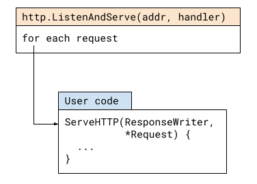

# Vòng đời của một HTTP request trong Go server

Go là một ngôn ngữ phổ biến và rất phù hợp để viết HTTP servers. Bài viết này thảo luận về vòng đời của một HTTP request và sẽ đề cập đến một số chủ đề như routers, middleware và một số thứ liên quan khác chẳng hạn như concurrency.

Code cụ thể đễ theo dõi bài viết có thể xem [tại đây](https://gobyexample.com/http-servers)

```go
package main

import (
  "fmt"
  "net/http"
)

func hello(w http.ResponseWriter, req *http.Request) {
  fmt.Fprintf(w, "hello\n")
}

func headers(w http.ResponseWriter, req *http.Request) {
  for name, headers := range req.Header {
    for _, h := range headers {
      fmt.Fprintf(w, "%v: %v\n", name, h)
    }
  }
}

func main() {
  http.HandleFunc("/hello", hello)
  http.HandleFunc("/headers", headers)

  http.ListenAndServe(":8090", nil)
}
```

Ta bắt đầu truy vết vòng đời của HTTP request bằng cách kiểm tra hàm `http.ListenAndServe`:

```go
func ListenAndServe(addr string, handler Handler) error
```

Dưới đây là một sơ đồ đơn giản về cái gì sẽ xảy ra khi hàm trên được gọi

<div align="center" style={{"backgroundColor": "white"}}>
  
</div>

Phiên bản này đã được cắt gọn đi rất nhiều, nhưng [phiên bản gốc](https://go.googlesource.com/go/+/go1.15.8/src/net/http/server.go) cũng không quá khó để theo dõi cho lắm.

`ListenAndServe` lắng nghe trên cổng TCP theo địa chỉ cho trước, sau đó các vòng lặp chấp nhận các connections. Với mỗi connection thì Go sẽ dùng 1 goroutine để xử lý. Việc xử lý mỗi connection thì nằm trong vòng lặp sau:

- Parse HTTP request từ connection và tạo ra `http.Request`
- Pass `http.Request` đến 1 handler đã được user defined

Handler là bất cứ thứ gì có implement `http.Handler` interface:

```go
type Handler interface {
    ServeHTTP(ResponseWriter, *Request)
}
```

## Default handler

Ở ví dụ trên, `ListenAndServe` được gọi với tham số thứ 2 là `nil` trong khi đáng nhẽ phải là 1 handler đã được user defined.

Sơ đồ của chúng ta đã giản lược đi vài chi tiết, thực tết thì khi `http` package phục vụ 1 request. nó không gọi trực tiếp tới handler của user mà sử dụng adapter này:

```go
type serverHandler struct {
  srv *Server
}

func (sh serverHandler) ServeHTTP(rw ResponseWriter, req *Request) {
  handler := sh.srv.Handler
  // highlight-start
  if handler == nil {
    handler = DefaultServeMux
  }
  // highlight-end
  if req.RequestURI == "*" && req.Method == "OPTIONS" {
    handler = globalOptionsHandler{}
  }
  handler.ServeHTTP(rw, req)
}
```

Chú ý đến những dòng đã được highlighted. Nếu `handler == nil` thì `http.DefaultServeMux` sẽ được sử dụng như 1 handler. Đây là server mux mặc định - 1 global instance của `http.ServeMux` nằm trong `http` package.

Chúng ta có thể viết lại server như sau mà không sử dụng mux mặc định. Chỉ hàm `main` thay đổi nên ở đây sẽ không show `hello` và `headers` nữa nhưng bạn có thể xem full code [ở đây](https://github.com/ducnguyen96/ducnguyen96.github.io/tree/master/static/code/blog/go-life-http-request/basic-server-mux-object.go) [^1].

```go
func main() {
  mux := http.NewServeMux()
  mux.HandleFunc("/hello", hello)
  mux.HandleFunc("/headers", headers)

  http.ListenAndServe(":8090", mux)
}
```

## `ServeMux` chỉ là `Handler`

Khi đọc ví dụ về Go server thì sẽ dễ dàng đi đến kết luận rằng `ListenAndServe` nhận "mux" là một tham số, nhưng điều này là không chính xác. Như chúng ta đã thấy ở trên thì `ListenAndServe` nhận một giá trị có implement `http.Handler` interface. Chúng ta có thể viết một server mà không sử dụng bất cứ mux nào:

```go
type PoliteServer struct {
}

func (ms *PoliteServer) ServeHTTP(w http.ResponseWriter, req *http.Request) {
  fmt.Fprintf(w, "Welcome! Thanks for visiting!\n")
}

func main() {
  ps := &PoliteServer{}
  log.Fatal(http.ListenAndServe(":8090", ps))
}
```

Chúng ta chưa định tuyết nên tất cả các HTTP requests sẽ được đưa đến `ServeHTTP` method của `PoliteServer` và nó sẽ phản hồi với cùng 1 message cho tất cả.

Chúng ta cũng có thể làm server đơn giản hơn nữa bằng cách sử dụng `http.HandlerFunc`

```go
func politeGreeting(w http.ResponseWriter, req *http.Request) {
  fmt.Fprintf(w, "Welcome! Thanks for visiting!\n")
}

func main() {
  log.Fatal(http.ListenAndServe(":8090", http.HandlerFunc(politeGreeting)))
}
```

`HandlerFunc` ở đây là một adapter trong `http` package:

```go
// The HandlerFunc type is an adapter to allow the use of
// ordinary functions as HTTP handlers. If f is a function
// with the appropriate signature, HandlerFunc(f) is a
// Handler that calls f.
type HandlerFunc func(ResponseWriter, *Request)

// ServeHTTP calls f(w, r).
func (f HandlerFunc) ServeHTTP(w ResponseWriter, r *Request) {
  f(w, r)
}
```

Nếu bạn để ý `http.HandleFunc` trong ví dụ đầu tiên [^2] thì nó cũng sử dụng cùng adapter.

Giống như `PoliteServer` thì `http.ServeMux` là một type có implement `http.Handler` interface. Bạn có thể xem kỹ hơn ở [đây](https://go.googlesource.com/go/+/go1.15.8/src/net/http/server.go):

- `ServeMux` chứa 1 slice các cặp `{pattern, handler}` đã được sắp xếp(theo độ dài).
- `Handle` hoặc `HandleFunc` thêm một handler mới vào slice.
- `ServeHTTP`:
  - Tìm handler phù hợp cho request dựa vào path (bằng cách tìm kiếm trên các cặp được sắp xếp ở trên)
  - Gọi tới `ServeHTTP` method của handler.

Như vậy, có thể xem mux như là một _forwarding handler_; pattern này rất hay gặp ở trong HTTP server - _middleware_

## `http.Handler` Middleware

Rất khó để định nghĩa Middleware một cách chính xác vì nó mang ý nghĩa khác nhau dựa vào contexts, languages và frameworks.

Đơn giản hóa sơ đồ ban đầu mà ta có, dấu đi một vài chi tiết trong `http` package ta có:

<div align="center" style={{"backgroundColor": "white"}}>
  
</div>

Bây giờ thì sau khi thêm middleware nó sẽ trở thành:

<div align="center" style={{"backgroundColor": "white"}}>
  
</div>

Trong Go thì middleware chỉ là một HTTP handler bọc một handler khác.

Ở trên thì ta đã thấy một ví dụ về middleware - `http.ServeMux`; trường hợp này thì middleware sử dụng để select handler phù hợp dựa vào path của request.

Một ví dụ cụ thể khác. Quay lại ví dụ với polite server và thêm _logging middleware_.

```go
type LoggingMiddleware struct {
  handler http.Handler
}

func (lm *LoggingMiddleware) ServeHTTP(w http.ResponseWriter, req *http.Request) {
  start := time.Now()
  lm.handler.ServeHTTP(w, req)
  log.Printf("%s %s %s", req.Method, req.RequestURI, time.Since(start))
}

type PoliteServer struct {
}

func (ms *PoliteServer) ServeHTTP(w http.ResponseWriter, req *http.Request) {
  fmt.Fprintf(w, "Welcome! Thanks for visiting!\n")
}

func main() {
  ps := &PoliteServer{}
  lm := &LoggingMiddleware{handler: ps}
  log.Fatal(http.ListenAndServe(":8090", lm))
}
```

chú ý rằng `LoggingMiddleware` thực chất là một `http.Handler` có một field là user handler. Khi `ListenAndServe` gọi `ServeHTTP` method cảu nó:

1. Tiền xử lý: tạo 1 time stamp trước khi user handler chạy.
2. Gọi tới user handler với request và response writer.
3. Hậu xử lý: log request details cùng với thời gian đã dành để xử lý request.

Điều tuyệt vời về middleware là nó composable. Chúng có thể nối với nhau tạo thành một chuỗi `http.Handler` bao lấy nhau. Thực tế thì đây là một pattern thường thấy

```go
func politeGreeting(w http.ResponseWriter, req *http.Request) {
  fmt.Fprintf(w, "Welcome! Thanks for visiting!\n")
}

func loggingMiddleware(next http.Handler) http.Handler {
  return http.HandlerFunc(func(w http.ResponseWriter, req *http.Request) {
    start := time.Now()
    next.ServeHTTP(w, req)
    log.Printf("%s %s %s", req.Method, req.RequestURI, time.Since(start))
  })
}

func main() {
  lm := loggingMiddleware(http.HandlerFunc(politeGreeting))
  log.Fatal(http.ListenAndServe(":8090", lm))
}
```

Thay vì tạo một struct cùng với methods thì `loggingMiddleware` sử dụng `http.HandlerFunc` với một closure giúp code ngắn gọn hơn trong khi vẫn giữ được đầy đủ tính năng. Quan trọng hơn thì pattern này đã được chuẩn hóa: một function nhận một `http.Handler` và trả về một `http.Handler` khác. Handler được trả về sẽ được sử dụng thay cho handler đã được truyền vào middleware và nó sẽ thực hiện chức năng gốc cùng với tính năng mới của middleware.

Ví dụ, thư viện chuẩn có sẵn một vài middleware:

```go
func TimeoutHandler(h Handler, dt time.Duration, msg string) Handler
```

Ta có thể sử dụng nó như sau:

```go
handler = http.TimeoutHandler(handler, 2 * time.Second, "timed out")
```

Đoạn code trên tạo một version handler mới cùng với cơ chế timeout trong vòng 2 giây.

Tính kết hợp của middleware có thể thấy qua ví dụ sau:

```go
handler = http.TimeoutHandler(handler, 2 * time.Second, "timed out")
handler = loggingMiddleware(handler)
```

Sau 2 dòng trên thì `handler` bây giờ có thêm tính năng timeout và logging. Nếu chú ý thì có thể thấy việc nối một chuỗi dài các middlewares sẽ trở nên khá phiền phức và đã có một vài package phổ biến để giải quyết vấn đề này nhưng nó nằm ngoài scope của bài viết.

Nhân tiện thì chính `http` package cũng sử dụng middleware đễ có thể xử lý trường hợp `nil` handlers.

## Concurrency và xử lý panic

Để kết thúc bài viết thì ta sẽ nói thêm về 2 chủ đề: concurrency và xử lý panic

Đầu tiên về _concurrency_. Như đã đề cập ở trên thì mỗi connection được xử lý bằng 1 goroutine.

Đây là một tính năng mạnh mẽ của `net/http`, nó đã tận dụng khả năng concurrency của Go, bằng cách sử dụng goroutines thì nó cung cấp một model cho HTTP handler rất clean. Một handler có thể block (chẳng hạn việc đọc dữ liệu từ database) mà không phải lo về việc hoãn lại các handlers khác mặc dù nó yêu cầu chúng ta phải cẩn thân khi viết handler có tương tác với shared data. Xem [bài viết này](/blog/2019/on-concurrency-in-go-http-servers) để biết thêm chi tiết.

Cuối cùng là về xử lý panic. Một HTTP server điển hình thì cần phải là một process có thể chạy liên tục. Giả sử có lỗi gì đấy trong handler nào đấy của user(chẳng hạn như bug dẫn tới runtime panic). Điều này có thể gây sập toàn bộ server. Để phòng trường hợp điều này xảy ra thì bạn có thể nghĩ tới việc sử dụng `recover` ở trong `main`, nhưng nó sẽ không hiệu quả vì một vài lý do sau đây:

1. Tại thời điểm chạy tới hàm `main` thì `ListenAndServe` đã chạy và sẽ không tiếp tục serve nữa.
2. Vì mỗi connection được xử lý bởi 1 goroutine nên khi panics xảy ra ở handlers nó sẽ không chạy đến hàm `main` mà sẽ crash.

Để giải quyết vấn đề này thì `net/http` có recovery được tích hợp sẵn cho từng goroutine (nằm trong `conn.serve` method). Chúng ta có thể thấy được qua ví dụ sau:

```go
func hello(w http.ResponseWriter, req *http.Request) {
  fmt.Fprintf(w, "hello\n")
}

func doPanic(w http.ResponseWriter, req *http.Request) {
  panic("oops")
}

func main() {
  http.HandleFunc("/hello", hello)
  http.HandleFunc("/panic", doPanic)

  http.ListenAndServe(":8090", nil)
}
```

Nếu ta chạy server và dùng `curl` tới `/panic` thì đây là output:

```bash
curl localhost:8090/panic
curl: (52) Empty reply from server
```

Và server sẽ in ra logs:

```bash
2021/02/16 09:44:31 http: panic serving 127.0.0.1:52908: oops
goroutine 8 [running]:
net/http.(*conn).serve.func1(0xc00010cbe0)
  /usr/local/go/src/net/http/server.go:1801 +0x147
panic(0x654840, 0x6f0b80)
  /usr/local/go/src/runtime/panic.go:975 +0x47a
main.doPanic(0x6fa060, 0xc0001401c0, 0xc000164200)
[... rest of stack dump here ...]
```

Tuy nhiên, server vẫn sẽ tiép tục chạy và ta vẫn có thể tương tác với nó.

Mặc dù tính năng này tốt hơn việc sập server nhưng có thể thấy rằng nó cũng có một vài hạn chế. Tất cả những gì nó làm là đón connection và log error; sẽ hữu ích hơn nếu nó trả về cho client error response (chẳng hạn như 500 - internal server error).

Tuy nhiên sau khi đọc bài này thì chắc hẳn bạn có thể viết 1 middleware cho tính năng này.

## Sources

- https://eli.thegreenplace.net/2021/life-of-an-http-request-in-a-go-server/

[^1]: Có một vài lý do bạn nên sử dụng cách này thay default mux. Sử dụng default mux khá rủi ro, vì nó global nên nó có thể bị thay đổi bởi 1 package nào đấy và sử dụng cho 1 mục đích bất chính.
[^2]: Cẩn thận: `http.HandleFunc` và `http.HandlerFunc` mặc dù liên quan nhưng chúng là 2 đối tượng khác nhau.
