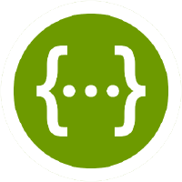

# Sử dụng OpenAPI và Swagger

Trong bài này ta sẽ thảo luận cách mà OpenAPI và Swagger được sử dụng để define REST APIs một cách được tiêu chuẩn hóa và tìm hiểu cách để generate Go code từ OpenAPI specification.

## Vấn đề

Ở [phần 1](./standard-library) - chúng ta đã define các đầu API - chúng cũng có format nhưng không theo bất cứ 1 tiêu chuẩn nào, chỉ là 1 list gồm method, path cùng với comments.

```js
POST   /task/              :  create a task, returns ID
GET    /task/<taskid>      :  returns a single task by ID
GET    /task/              :  returns all tasks
DELETE /task/<taskid>      :  delete a task by ID
GET    /tag/<tagname>      :  returns list of tasks with this tag
GET    /due/<yy>/<mm>/<dd> :  returns list of tasks due by this date
```

Nếu có 1 tiêu chuẩn nào đó để mô tả những API thì chẳng phải sẽ tốt hơn sao? Tiêu chuẩn ở đây nghĩa là nó đóng vai trò như 1 chuẩn giữa clients và servers giúp máy có thể đọc hiểu và giúp ta tự động hóa được.

## Swagger và OpenAPI

[Swagger](<https://en.wikipedia.org/wiki/Swagger_(software)>) được released lần đầu vào 2011 như một [IDL](https://en.wikipedia.org/wiki/Interface_description_language) để mô tả REST APIs.

<div align="center">

</div>

Sự ra đời của Swagger lúc đầu nhằm để gen documents cho REST APIs cũng như 1 số ví dụ để tương tác với API [^1].

Năm 2014, thì phiên bản 2.0 được release và vào 2016 thì một số công ty lớn đã hợp tác với nhau để tạo ra OpenAPI - một phiên bản Swagger tiêu chuẩn hơn - Swagger 3.0.

Trang web chính thức của Swagger và OpenAPI là https://swagger.io, được hỗ trợ bởi [Smart Bear Software](https://smartbear.com/).

Chúng ta có thể hiểu OpenAPI là tên của specification còn Swagger là công cụ (mặc dù bạn cũng có thể bắt gặp cụm từ "Swagger specification" - nó ám chỉ đến chuẩn của các phiên bản trước đó)

## Áp dụng OpenAPI vào Task service

Ta sẽ viết lại task service sử dụng OpenAPI và Swagger.

Đầu tiên thì dành 1 ít thời gian để đọc tài liệu về OpenAPI 3.0 sau đó mở [Swagger Editor](https://editor.swagger.io/) để define service của chúng ta vào 1 file [YAML](https://github.com/ducnguyen96/ducnguyen96.github.io/tree/master/static/code/docs/go/rest-server/swagger/task.yaml).

Dưới đây là một ví dụ cho `GET /task/` request.

```yml
/task:
  get:
    summary: Returns a list of all tasks
    responses:
      "200":
        description: A JSON array of task IDs
        content:
          application/json:
            schema:
              type: array
              items:
                $ref: "#/components/schemas/Task"
```

`components/schemas/Task` trỏ đến 1 schema được define như dưới đây:

```yml
components:
  schemas:
    Task:
      type: object
      properties:
        id:
          type: integer
        text:
          type: string
        tags:
          type: array
          items:
            type: string
        due:
          type: string
          format: date-time
```

Có thể thấy rằng ta có thể chỉ định type cho các trường của dữ liệu - điều này về mặt lý thuyết thì có thể giúp ta auto gen validators.

Và qua file YAML kia thì ta đã có một document cho API:

<div align="center">

</div>

Trên đây chỉ là 1 screenshot, thực tế ta có thể click và expend để thấy được thông tin chi tiết hơn về tham số của request cũng như response, v.v

Hơn nữa thì ta có thể tương tác với server thông qua swagger tương tự như qua `curl` nhưng trực quan hơn và theo format chuẩn hơn.

Swagger cũng sẽ rất hữu ích cho những người không phải software engineers mà muốn sử dụng API - chẳng hạn UX designers, product managers muốn hiểu về API nhưng không muốn sử dụng script.

OpenAPI cũng tiêu chuẩn hóa những thứ như authorization.

Ngoài ra còn có những công cụ khác như [Swagger UI](https://swagger.io/tools/swagger-ui/), [Swagger Inspector](https://swagger.io/tools/swagger-inspector/), [Cloud Endpoints for OpenAPI](https://cloud.google.com/endpoints/docs/openapi), ...

## Auto gen phần khung của server

`OpenAPI/Swagger` không chỉ để sử dụng cho documentation mà chúng ta còn có thể gen code cho cả client lẫn server nhờ nó.

Sử dụng hướng dẫn từ [Swagger codegen project](https://github.com/swagger-api/swagger-codegen) để gen phần khung cho server. Sau đó thì hoàn thành nốt các handlers ta được kết quả như [đây](https://github.com/ducnguyen96/ducnguyen96.github.io/tree/master/static/code/docs/go/rest-server/swagger). Các bước chi tiết có thể xem ở phần README.

Có 1 vài hạn chế khi tiếp cận theo cách này như sau:

1. Tên package và imports của phần code được gen ra cần tái cấu trúc 1 ít để phù hợp với Go modules.
2. Vì lý do nào đấy mà một vài file khi được gen ra không tương thích tốt với `gofmt`
3. Các handler functions được gen ra là global top-level functions, trong các bài trước thì ta luôn viết các hàm này là các methods của server struct.
4. Mặc dù ta đã define type của 1 số trường là integer chẳng hạn như day, month, year nhưng phần code gen ra không có validation. Hơn nữa thì `gorilla/mux` có hỗ trợ regex tuy nhiên code gen ra lại không sử dụng

Nhìn chung thì lợi ích của việc sử dụng auto gen code không rõ ràng lắm. Nó tiết kiệm không quá nhiều thời gian cũng như phải rewrite lại 1 vài chỗ. Hơn nữa thì nếu bạn update các file YAML kia thì code gen ra cũng k thể bỗng dưng mà update theo cách mà bạn muốn được.

`swagger-codegen` cũng có thể gen _clients_ code, dù vẫn hữu ích trong 1 vài trường hợp tuy nhiên nó cũng gặp phải vấn đề tương tự như gen server code.

Nhưng bạn vẫn có thể sử dụng tool này để gen template code để tiết kiệm thời gian lúc mới bắt đầu viết app.

## Thử một vài code generators khác.

OpenAPI được viết dưới dạng YAML hoặc JSON. Sẽ không bất ngờ nếu có nhiều tool để gen code, ở trên thì ta đã sử dụng tool chính thức của Swagger, dưới đây thì ta sẽ sử dụng 1 công cụ khác là [go-swagger](https://github.com/go-swagger/go-swagger).

> **Tool này thì khác với tool trên thế nào?**
>
> Điểm khác biệt lớn nhất là tool này chỉ focus vào Go nên code gen ra tốt hơn :v.

Đầu tiên phải nhấn mạnh là `go-swagger` chỉ hỗ trợ Swagger 2.0.

Code gen bởi `go-swagger` chắc chắn là nhiều tính năng hơn code gen bởi `swagger-codegen` tuy nhiên nó lại đi kèm với 1 đống [dependencies của go-openapi](https://github.com/go-openapi/)

`go-swagger` cũng có thể gen client code nhưng tương tự thì nó cũng đầy tính năng và rất opinionated(bạn đã dùng thì phải theo format, style của nó).

**Update 2021-02-27**: Có 1 tool khác nữa là [oapi-codegen](https://github.com/deepmap/oapi-codegen), bạn có thể xem 1 phiên bản khác của task server sử dụng tool này tại [đây](https://github.com/ducnguyen96/ducnguyen96.github.io/tree/master/static/code/docs/go/rest-server/swagger/oapi-server)

Phải thừa nhận thằng `oapi-codegen` generate code clean và dễ custom hơn, nó cũng hỗ trợ OpenAPI v3 nữa. Điểm trừ duy nhất là nó sử dụng 1 package bên thứ 3 để bind request params.

## Gen specs từ code

Chẳng hạn nếu bạn đã có 1 REST server nào đấy nhưng rất thích ý tưởng của OpenAPI thì bạn có thể sử dụng nó để gen specs.
Tool [này](https://github.com/swaggo/swag) giúp bạn generate specs từ comment (tuy nhiên thì nó cũng chỉ support bản 2.0)

Yes! Using special comment annotations and tools like [swaggo/swag](https://github.com/swaggo/swag), the spec (unfortunately only version 2.0, again) will be generated for you. You can then feed this spec into other Swagger tooling for all your documentation needs.

## Kết luận

Tóm lại nếu bạn có 1 ứng dụng muốn sử dụng REST API thì dưới đây là 2 options dành cho bạn:

1. Mô tả API dưới dạng text file và cung cấp vài mẫu `curl` commands để tương tác với nó.
2. Sử dụng OpenAPI spec với 1 document đẹp và được tiêu chuẩn hóa cùng các công cụ giúp user tương tác online mà không cần sử dụng terminal.

Rõ ràng là option 2 tốt hơn nhiều, tuy nhiên thì cũng nên cân nhắc việc có nên sử dụng tool để gen code hay không. Cá nhân mình thì muốn control code. dependencides, cách cấu trúc server của mình. Mặc dù không thể phủ nhận lợi ích mà codegen mang lại thì cá nhân mình sẽ không sử dụng codegen.

`swaggo/swag` có thể là phù hợp nhất. Bạn có thể viết code sử dụng bất cứ framework/technique nhưng vẫn có thể gen OpenAPI spec từ comments.

## Sources

- https://eli.thegreenplace.net/2021/rest-servers-in-go-part-4-using-openapi-and-swagger

[^1]: Xem lại [manual.sh script](https://github.com/ducnguyen96/ducnguyen96.github.io/tree/master/static/code/docs/go/rest-server/testing/manual.sh) từ [Phần 1](./standard-library). Script này chứa 1 vài `curl` commands để tương tác với server của chúng ta. Rõ ràng là ta có thể auto gen những commands này từ các REST API đã được tiêu chuẩn hóa(nghĩa là theo 1 format nhất định) giúp ta tiết kiệm kha khá thời gian.
