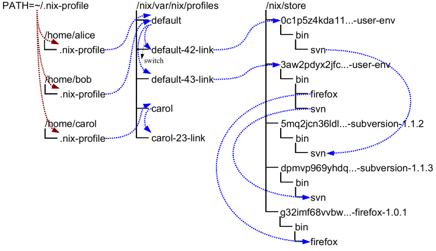

# Profiles

Profiles và user environments là các cơ chế của Nix cho phép các users khác nhau có thể có các config khác nhau, có thể `atomic` upgrade và rollbacks.
Để hiểu cách hoạt động của 2 cơ chế này thì ta cần phải hiểu Nix hoạt động thế nào.

Trong Nix, các packages được stored trong các locations khác nhau trong Nix store (thường là `/nix/store`). Ví dụ, một version cụ thể của package Subversion có thể được stored trong directory `/nix/store/dpmvp969yhdqs7lm2r1a3gng7pyq6vy4-subversion-1.1.3/`, trong khi version khác có thể được stored trong `/nix/store/5mq2jcn36ldlmh93yj1n8s9c95pj7c5s-subversion-1.1.2`. Đoạn string dài được prefix vào tên directory là cryptographic hashes (chính xác là 160-bit truncations của SHA-256 hashes được encoded trong base-32 notation) của tất cả các inputs được sử dụng trong quá trình build package - sources, dependencies, compiler flags, và cả những thứ khác. Vì vậy nếu 2 packages khác nhau ở bất kì điểm nào thì chúng sẽ được stored ở các locations khác nhau trong file system, và vì thế chúng sẽ không ảnh hưởng tới nhau. Dưới đây là một ví dụ về Nix store:

<div align="center">

</div>

Tất nhiên là bạn sẽ không gõ

```bash
/nix/store/dpmvp969yhdq...-subversion-1.1.3/bin/svn
```

mỗi lần bạn muốn dùng Subversion. Tất nhiên là ta có thể update `PATH` để include các thư mục chứa tất cả các packages bạn muốn dùng, nhưng điều này không tiện lắm vì thay đổi `PATH` không có tác dụng với các process đang chạy. Giải pháp mà Nix sử dụng là tạo ra các cây thư mục bao gồm các symlinks tới các packages đã được activate. Ví dụ, trong hình trên, user environment `/nix/store/0c1p5z4kda11...-user-env` chứa một symlink tới Subversion 1.1.2 (mũi tên trong hình chỉ ra symlinks). Env này được tạo ra sau khi ta chạy:

```bash
nix-env --install --attr nixpkgs.subversion
```

Chúng ta vẫn giải quyết được vấn đề vì tất nhiên là bạn cũng sẽ không muốn gõ `/nix/store/0c1p5z4kda11...-user-env/bin/svn` mỗi lần bạn muốn dùng Subversion. Vậy nên Nix tạo ra các sym links ở bên ngoài store được trỏ đến các user env. Ví dụ, các symlinks `default-42-link` và `default-43-link` ở hình trên. Các symlinks này được gọi là generations vì mỗi khi bạn sử dụng nix-env operation, một user env mới được tạo ra dựa trên user env hiện tại. Ví dụ, generation 43 được tạo ra từ generation 42 khi ta chạy:

```bash
nix-env --install --attr nixpkgs.subversion nixpkgs.firefox
```

Các generations được group lại thành các profiles cho nên các users khác nhau sẽ không ảnh hưởng tới nhau nếu họ không muốn. Ví dụ:

:::info

Ở đây thì bạn có thể phân vân giữa generations và profiles. Theo hình trên thì ta thấy có nhiều profiles như `default`, `default-42-link`, `default-43-link`, `carol`, `carol-23-link`. Ở đây ta có thể hiểu là `default` và `carol` là các profiles, còn `default-42-link`, `default-43-link`, `carol-23-link` là các generations của các profiles đó.

:::

```bash
$ ls -l /nix/var/nix/profiles/
...
lrwxrwxrwx  1 eelco ... default-42-link -> /nix/store/0c1p5z4kda11...-user-env
lrwxrwxrwx  1 eelco ... default-43-link -> /nix/store/3aw2pdyx2jfc...-user-env
lrwxrwxrwx  1 eelco ... default -> default-43-link
```

Trong ví dụ này ta có 1 profile `default`. File `default` là một symlink trỏ tới generation hiện tại. Khi ta thực hiện một nix-env operation, một user env và generation link mới được tạo ra dựa trên generation hiện tại, và cuối cùng thì symlink `default` sẽ trỏ tới generation mới. Điều này cũng giải thích tại sao ta có thể atomic upgrades.

Nếu bạn muốn undo một nix-env operation, có thể chạy:

```bash
nix-env --rollback
```

Profile hiện tại sẽ được rollback và trỏ về generation trước đó. Nếu bạn muốn rollback về một generation cụ thể, có thể chạy:

```bash
nix-env --switch-generation 43
```

Profile sẽ trỏ về generation 43. Bạn cũng có thể xem tất cả các generations bằng cách:

```bash
nix-env --list-generations
```

Tận dụng cơ chế này thì ta sẽ không cần `/nix/var/nix/profiles/some-profile/bin` trong `PATH`. Thay vào đó thì ta dùng `~/.nix-profile` - là symlink profile hiện tại của user. Và để include các packages trong profile hiện tại vào `PATH`, ta chỉ cần include `~/.nix-profile/bin` vào `PATH`.

Bạn cũng có thể đổi profile bằng cách sử dụng `nix-env --switch-profile`

```bash
nix-env --switch-profile /nix/var/nix/profiles/my-profile
```

hoặc

```bash
nix-env --switch-profile /nix/var/nix/profiles/default
```

Nếu profile chưa tồn tại thì Nix sẽ tạo mới.

Tất cả các `nix-env` operations sẽ ảnh hưởng tới profile hiện tại. Nếu bạn muốn thực hiện các operations trên một profile khác, bạn có thể sử dụng `--profile` option. Ví dụ:

```bash
nix-env --profile /nix/var/nix/profiles/other-profile --install --attr nixpkgs.subversion
```
