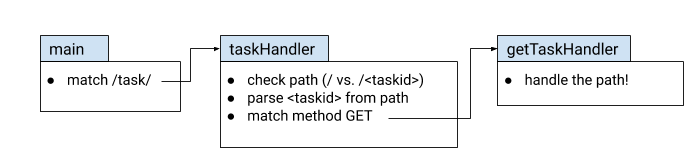

# Sử dụng router module

[Phần 1](/docs/nodejs/rest-server/standard-library) kết thúc với 1 Nodejs server, ta đã refactor bước render JSON thành 1 helper function.

Vấn đề còn lại là path routing logic, hiện tại đang rải rác ở nhiều nơi.

Đây là vấn đề mọi người gặp phải khi cố gắng viết servers mà không sử dụng dependencies. Trừ khi server có routes rất đơn giản(có 1 vài server chuyên biệt chỉ có 1 hay 2 routes), sự dài dòng và khó khăn trong việc quản lý code của router là điều sẽ sớm được nhận thấy.

## Routing nâng cao

Đầu tiên ta sẽ trừu tượng hóa routing bằng cách sử dụng 1 vài functions hoặc là 1 data type cùng với methods. Có nhiều cách thú vị để làm và cũng có nhiều packages bên thứ 3 giải quyết vấn đề này. Bạn nên đọc [bài viết của Ben Hoyt](/blog/2023/go-routing), trong đó anh ấy so sánh và đối chiếu nhiều cách tiếp cận khác nhau cho 1 set routes đơn giản.

Hãy xem lại REST API của server:

```js
POST   /task/              :  create a task, returns ID
GET    /task/<taskid>      :  returns a single task by ID
GET    /task/              :  returns all tasks
DELETE /task/<taskid>      :  delete a task by ID
GET    /tag/<tagname>      :  returns list of tasks with this tag
GET    /due/<yy>/<mm>/<dd> :  returns list of tasks due by this date
```

1. Thêm cách để set các handlers khác nhau cho các method khác nhau trên cùng 1 route. Ví dụ `POST` cho `/task/` sẽ đi vào 1 handler, `GET /task/` sẽ đi vào 1 handler khác, v.v.
2. Thêm cách để có thể match "sâu" hơn; ví dụ `/task/` sẽ đi vào 1 handler, trong khi `/task/<taskid>` với `taskid` là 1 số sẽ đi vào 1 handler khác.
3. Matcher sẽ chỉ extract số ID từ `/task/<taskid>` và pass nó vào handler một cách thuận tiện.

## Task server sử dụng pillarjs/router

Không giống với Go thì các web server sử dụng Nodejs thường sử dụng frameworks. Nên việc sử dụng 1 router package là không quá phổ biến. Nhìn vào lượt npm downloads thì ta dễ dàng nhận thấy là expressjs là 1 trong những framework phổ biến nhất. [pillarjs/router](https://github.com/pillarjs/router) thực chất là "_một bản được tách ra từ expressjs với thay đổi chính là nó có thể sử dụng được với `http.createServer` hoặc bất cứ web frameworks nào bằng cách loại bỏ các API được sử dụng trong expressjs._"

Dưới đây là cách routes được defined:

```js
const server = new TaskServer();

const router = Router({ strict: true, mergeParams: true });

router.post("/task/", server.createTaskHandler.bind(server));
router.get("/task/", server.getAllTasksHandler.bind(server));
router.delete("/task/", server.deleteAllTasksHandler.bind(server));
router.get("/task/:id(\\d+)", server.getTaskHandler.bind(server));
router.delete("/task/:id(\\d+)", server.deleteTaskHandler.bind(server));
router.get("/tag/:tag", server.tagHandler.bind(server));
router.get(
  "/due/:year(\\d+)/:month(\\d+)/:day(\\d+)",
  server.dueHandler.bind(server)
);

const httpServer = http.createServer((req, res) => {
  router(req, res, finalhandler(req, res));
});
```

Chúng ta có thể thấy (1) và (2) đã được giải quyết. Bằng cách gán http method vào từng route, ta có thể dễ dàng trỏ route với các methods khác nhau đến các handlers khác nhau. Pattern matching(sử dụng regexp) ở trong path cũng giúp ta có thể dễ dàng phân biệt giữa `/task/` và `/task/<taskid>`.

Hãy xem (3) được giải quyết trong `getTaskHandler`:

```js
/**
 * @param {http.IncomingMessage} req
 * @param {http.ServerResponse} res
 */
getTaskHandler(req, res) {
  console.info(`handling get task at ${getPathname(req)}`);
  try {
    const task = this.store.getTask(req.params.id);
    return renderJSON(res, task);
  } catch (error) {
    res.statusCode = 404;
    res.statusMessage = error;
    res.end();
    return;
  }
}
```

So với version trước:

```js
const id = parseInt(pathParts[2]);
if (Number.isNaN(id)) {
  res.statusCode = 400;
  res.statusMessage = "expect id is a number";
  return res.end();
}

switch (method) {
  case METHOD.DELETE:
    return this.deleteTaskHandler(req, res, id);
  case METHOD.GET:
    return this.getTaskHandler(req, res, id);
```

Ở đây ta không cần check error vì router chỉ match vói pattern `[0-9]+` tức là phần match kia chỉ chứa số. Nếu không match được thì router sẽ trả về 404 (nhờ vào [finalhandler](/blog/2023/what-is-finalhandler)).

## So sánh 2 cách tiếp cận

Đây là cách mà route `GET /task/<taskid>` được xử lý trong server ban đầu:

<div align="center" style={{"backgroundColor": "white"}}>

</div>

Còn đây là cách mà route `GET /task/<taskid>` được xử lý trong server sử dụng `pillarjs/router`:

<div align="center" style={{"backgroundColor": "white"}}>

</div>

Mỗi route với 1 method và 1 handler cụ thể làm cho việc đọc code dễ dàng hơn rất nhiều. Cách define route của `pillarjs/router` cũng ngắn gọn, trực quan và dễ hiểu. Một điểm cộng nữa là chúng ta có thể thấy tất cả các routes nằm gọn cùng 1 chỗ. Thực tế thì bây giờ nhìn nó rất giống với phần mà ta đã define sơ qua lúc đầu.

`pillarjs/router` là một package chỉ làm 1 thứ và làm tốt việc đấy, nó không ảnh hưởng quá nhiều để khó có thể thay thế hay loại bỏ về sau và thực sự với server này thì ta chỉ thêm vài dòng code. Nếu trong quá trình phát triển thấy package này còn nhiều hạn chế thì việc thay thế nó bằng 1 router khác sẽ hết sức đơn giản.
