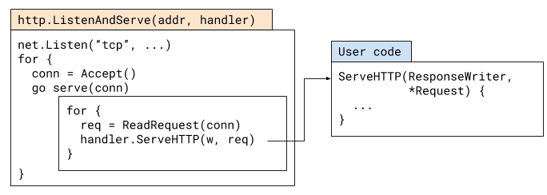
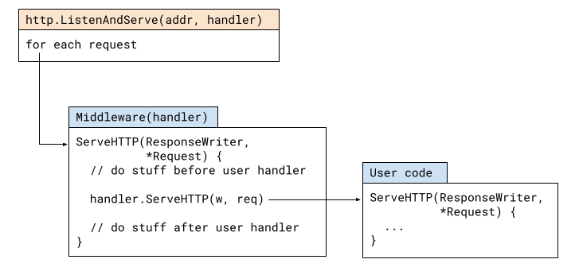

# Life of an HTTP request in a Go server

Go is a common and well-suited tool for writing HTTP servers. This post discusses the route a typical HTTP request takes through a Go server, touching upon routers, middleware and other related issues like concurrency.

To have some concrete code to look at, let's start with this trivial server (taken from https://gobyexample.com/http-servers):

```go
package main

import (
  "fmt"
  "net/http"
)

func hello(w http.ResponseWriter, req *http.Request) {
  fmt.Fprintf(w, "hello\n")
}

func headers(w http.ResponseWriter, req *http.Request) {
  for name, headers := range req.Header {
    for _, h := range headers {
      fmt.Fprintf(w, "%v: %v\n", name, h)
    }
  }
}

func main() {
  http.HandleFunc("/hello", hello)
  http.HandleFunc("/headers", headers)

  http.ListenAndServe(":8090", nil)
}
```

We'll begin tracing the life of an HTTP request through this server by looking at the `http.ListenAndServe` function:

```go
func ListenAndServe(addr string, handler Handler) error
```

A simplified flow of what's going on when it's called is shown in this diagram:

<div align="center" style={{"backgroundColor": "white"}}>
  
</div>

This is a heavily "inlined" version of the actual sequence of function and method calls, but the [original code](https://go.googlesource.com/go/+/go1.15.8/src/net/http/server.go) isn't too hard to follow.

The main flow is pretty much what you'd expect: `ListenAndServe` listens on the TCP port for the given address, and then loops accepting new connections. For each new connection it spins a goroutine to serve it (more on this later). Serving the connection involves a loop of:

- Parse an HTTP request from the connection; produce `http.Request`
- Pass the `http.Request` to the user-defined handler

A handler is anything that implements the `http.Handler` interface:

```go
type Handler interface {
    ServeHTTP(ResponseWriter, *Request)
}
```

## The default handler

In our sample code, `ListenAndServe` is invoked with nil as the second argument, which is supposed to be the user-defined handler. What's going on?

Our diagram simplifies some details; in reality, when the HTTP package serves a request, it doesn't call the user's handler directly but uses this adapter:

```go
type serverHandler struct {
  srv *Server
}

func (sh serverHandler) ServeHTTP(rw ResponseWriter, req *Request) {
  handler := sh.srv.Handler
  // highlight-start
  if handler == nil {
    handler = DefaultServeMux
  }
  // highlight-end
  if req.RequestURI == "*" && req.Method == "OPTIONS" {
    handler = globalOptionsHandler{}
  }
  handler.ServeHTTP(rw, req)
}
```

Note the highlighted lines: if `handler == nil`, then `http.DefaultServeMux` is used as the handler. This is the default server mux - a global instance of the `http.ServeMux` type held in the http package. Incidentally, when our sample code registers handlers with `http.HandleFunc`, it registers them on this very same default mux.

We could rewrite our sample server as follows, without using the default mux. Only the `main` function changes, so I won't show the `hello` and `headers` handlers, but you can see the full code [here](https://github.com/eliben/code-for-blog/blob/master/2021/go-life-http-request/basic-server-mux-object.go). There's no change in functionality [^1]:

```go
func main() {
  mux := http.NewServeMux()
  mux.HandleFunc("/hello", hello)
  mux.HandleFunc("/headers", headers)

  http.ListenAndServe(":8090", mux)
}
```

## A `ServeMux` is just a `Handler`

When reading lots of Go server examples it's easy to come to believe that `ListenAndServe` "takes a mux" as argument, but this isn't precise. As we've seen above, what `ListenAndServe` takes is a value implementing the `http.Handler` interface. We could write the following server without any muxes:

```go
type PoliteServer struct {
}

func (ms *PoliteServer) ServeHTTP(w http.ResponseWriter, req *http.Request) {
  fmt.Fprintf(w, "Welcome! Thanks for visiting!\n")
}

func main() {
  ps := &PoliteServer{}
  log.Fatal(http.ListenAndServe(":8090", ps))
}
```

There is no routing here; all HTTP requests go to the `ServeHTTP` method of `PoliteServer` and it replies with the same message to all of them. Try `curl`-ing this server with different paths and methods; it's nothing if not consistent.

We can simplify our polite server even more by using `http.HandlerFunc`:

```go
func politeGreeting(w http.ResponseWriter, req *http.Request) {
  fmt.Fprintf(w, "Welcome! Thanks for visiting!\n")
}

func main() {
  log.Fatal(http.ListenAndServe(":8090", http.HandlerFunc(politeGreeting)))
}
```

Where `HandlerFunc` is this clever adapter living in the `http` package:

```go
// The HandlerFunc type is an adapter to allow the use of
// ordinary functions as HTTP handlers. If f is a function
// with the appropriate signature, HandlerFunc(f) is a
// Handler that calls f.
type HandlerFunc func(ResponseWriter, *Request)

// ServeHTTP calls f(w, r).
func (f HandlerFunc) ServeHTTP(w ResponseWriter, r *Request) {
  f(w, r)
}
```

If you'll notice `http.HandleFunc` in the first example in the post [^2], it uses the same adapter for functions that have the HandlerFunc signature.

Just like `PoliteServer`, `http.ServeMux` is a type implementing the `http.Handler` interface. You can peruse its [full code](https://go.googlesource.com/go/+/go1.15.8/src/net/http/server.go) if you'd like; here's an outline:

- `ServeMux` keeps a sorted (by length) slice of `{pattern, handler}` pairs.
- `Handle` or `HandleFunc` adds a new handler to the slice
- `ServeHTTP`:
  - Finds the handler for the request's path (by searching the sorted slice of pairs)
  - Calls the handler's `ServeHTTP` method

As such, the mux can be seen as a _forwarding handler_; this pattern is extremely common in HTTP server programming. This is _middleware_.

## `http.Handler` Middleware

Middleware is difficult to define precisely because it means slightly different things in different contexts, languages and frameworks.

Let's take the flow diagram from the beginning of this post and simplify it a bit, hiding the details of what the `http` package does:

<div align="center" style={{"backgroundColor": "white"}}>
  
</div>

Now, here's how the flow looks when we add middleware.

<div align="center" style={{"backgroundColor": "white"}}>
  
</div>

In Go, middleware is just another HTTP handler which wraps a different handler. The middleware handler is registered to be called by `ListenAndServe`; when called, it can do arbitrary preprocessing, call the wrapper handler and then do arbitrary postprocessing.

We've seen one example of middleware above - `http.ServeMux`; in that case, the preprocessing is selecting the right user handler to call, based on the path of the request. There is no postprocessing.

For another concrete example, let's revisit our polite server and add some basic _logging middleware_. This middleware logs details of every request, including how long it took to execute:

```go
type LoggingMiddleware struct {
  handler http.Handler
}

func (lm *LoggingMiddleware) ServeHTTP(w http.ResponseWriter, req *http.Request) {
  start := time.Now()
  lm.handler.ServeHTTP(w, req)
  log.Printf("%s %s %s", req.Method, req.RequestURI, time.Since(start))
}

type PoliteServer struct {
}

func (ms *PoliteServer) ServeHTTP(w http.ResponseWriter, req *http.Request) {
  fmt.Fprintf(w, "Welcome! Thanks for visiting!\n")
}

func main() {
  ps := &PoliteServer{}
  lm := &LoggingMiddleware{handler: ps}
  log.Fatal(http.ListenAndServe(":8090", lm))
}
```

Note how `LoggingMiddleware` is itself an `http.Handler` that holds the user handler as a field. When `ListenAndServe` calls its `ServeHTTP` method, it does:

1. Preprocessing: record a time stamp before the user handler runs
2. Call the user handler with the request and response writer
3. Postprocessing: log the request details, along with time elapsed

The great thing about middleware is that it's composable. The "user handler" wrapped by middleware can be another middleware, and so on. It's a chain of `http.Handler` values wrapping each other. In fact, this is a common pattern in Go, which leads us to how Go middleware typically looks. Here's our logging polite server again, with a more recognizable Go middleware implementation:

```go
func politeGreeting(w http.ResponseWriter, req *http.Request) {
  fmt.Fprintf(w, "Welcome! Thanks for visiting!\n")
}

func loggingMiddleware(next http.Handler) http.Handler {
  return http.HandlerFunc(func(w http.ResponseWriter, req *http.Request) {
    start := time.Now()
    next.ServeHTTP(w, req)
    log.Printf("%s %s %s", req.Method, req.RequestURI, time.Since(start))
  })
}

func main() {
  lm := loggingMiddleware(http.HandlerFunc(politeGreeting))
  log.Fatal(http.ListenAndServe(":8090", lm))
}
```

Instead of creating a struct with a method, `loggingMiddleware` leverages `http.HandlerFunc` in combination with a closure to make the code much more succinct, while preserving the same functionality. What's more important is that this demonstrates a de-facto standard _signature_ for middleware: a function that takes a `http.Handler`, sometimes along with other state, and returns a different `http.Handler`. The returned handler should now be used in lieu of the handler passed into the middleware, and will "magically" perform its original functionality wrapped with the middleware's functionality.

For example, the standard library has the following middleware included:

```go
func TimeoutHandler(h Handler, dt time.Duration, msg string) Handler
```

So if we have a `http.Handler` in our code, wrapping it like:

```go
handler = http.TimeoutHandler(handler, 2 * time.Second, "timed out")
```

Creates a new version of the handler with a 2-second timeout mechanism built in.

The composability of middleware can be demonstrated as follows:

```go
handler = http.TimeoutHandler(handler, 2 * time.Second, "timed out")
handler = loggingMiddleware(handler)
```

After these two lines, `handler` will have timeouts _and_ logging installed. You may note that long chains of middleware can become tedious to write; Go has a number of popular packages to address this, but that's outside the scope of this post.

By the way, even the `http` package uses middleware internally for its needs; see for example the `serverHandler` adapter described earlier in this post. It provides a clean way to handle `nil` user handlers in a default way (by passing the request to the default mux).

I hope this makes it clear why middleware is an attractive design aid. We can work on our "business logic" handlers, while completely orthogonally we leverage generic middleware that can enhance our handlers in many ways. I'll leave a fuller exploration of the possibilities here for a different post, however.

## Concurrency and panic handling

To finish up our exploration of what an HTTP request goes through in a Go HTTP server, let's cover two additional topics: concurrency and panic handling.

First, _concurrency_. As I've briefly mentioned above, each connection is handled in a new goroutine by `http.Server.Serve`.

This is a strong feature of Go's `net/http`, as it leverages Go's excellent concurrency capabilities, with cheap goroutines ensuring a very clean concurrency model for HTTP handlers. A handler can block (for example, by reading from a database) without worrying about stalling other handlers. This requires some care in writing handlers that have shared data, though. Read my [earlier post](/blog/2019/on-concurrency-in-go-http-servers) for more details.

Finally, `panic handling`. An HTTP server is typically meant to be a long-running process in the background. Suppose that something bad happens in a certain user-provided request handler, e.g. some sort of bug that leads to a runtime panic. This may crash the whole server, which isn't a great scenario. To protect yourself against this, you may consider adding a `recover` to your server's `main` function, but that won't help for a couple of reasons:

1. By the time control returns to `main`, `ListenAndServe` is already done so no more serving will happen.
2. Since each connection is handled in a separate goroutine, panics from handlers won't even reach `main` but will instead crash the process.

To provide some protection against this, `net/http` has built-in recovery for each serving goroutine (in the `conn.serve` method). We can see it in action with a simple example:

```go
func hello(w http.ResponseWriter, req *http.Request) {
  fmt.Fprintf(w, "hello\n")
}

func doPanic(w http.ResponseWriter, req *http.Request) {
  panic("oops")
}

func main() {
  http.HandleFunc("/hello", hello)
  http.HandleFunc("/panic", doPanic)

  http.ListenAndServe(":8090", nil)
}
```

If we run this server and `curl` to the `/panic` path, we'll see this:

```bash
$ curl localhost:8090/panic
curl: (52) Empty reply from server
```

And the server will print this to its log:

```bash
2021/02/16 09:44:31 http: panic serving 127.0.0.1:52908: oops
goroutine 8 [running]:
net/http.(*conn).serve.func1(0xc00010cbe0)
  /usr/local/go/src/net/http/server.go:1801 +0x147
panic(0x654840, 0x6f0b80)
  /usr/local/go/src/runtime/panic.go:975 +0x47a
main.doPanic(0x6fa060, 0xc0001401c0, 0xc000164200)
[... rest of stack dump here ...]
```

However, the server will keep running and we can still contact it!

While this built-in protection is better than crashing the server, many developers find it somewhat limiting. All it does is close the connection and log the error; often, it's more useful to return some sort of error response to the client (such as code 500 - internal server error) with additional details.

Having read this post, it should be easy to write middleware that accomplishes this. Try it as an exercise! I'll cover this use case in a future post.

## Sources

- https://eli.thegreenplace.net/2021/life-of-an-http-request-in-a-go-server/

[^1]: There are good reasons to prefer this version over the one using the default mux. The default mux is somewhat of a security risk; as a global it can be modified by any package your project imports. A malicious package could use for nefarious needs.
[^2]: Careful: `http.HandleFunc` and `http.HandlerFunc` are distinct entities with different, though related, roles.
