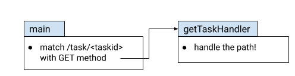

# Using a Router Package

[Part 1](/docs/go/rest-server/standard-library) concluded with a version of our Go server where we've refactored JSON rendering into a helper function, making specific route handlers fairly concise.

The remaining issue we had is the path routing logic, which is scattered across several places.

This is a problem all folks who write no-dependency HTTP servers run into. Unless the server is very minimal w.r.t. the routes it has (e.g. some specialized servers only have one or two routes they handle), the verbosity and difficulty of organizing the router code is something experienced programmers notice very quickly.

## Advanced Routing

The first instinct is to abstract the routing away, perhaps with a set of functions or a data type with methods. There are many interesting ad-hoc ways to do this, and many powerful and well-used 3rd party router packages in the Go ecosystem which do it for you. I strongly recommend reviewing [this post by Ben Hoyt](/blog/2023/go-routing), in which he compares and contrasts several approaches (ad-hoc and 3rd party) for a simple set of routes.

Let's revisit our server's REST API for a concrete example:

```js
POST   /task/              :  create a task, returns ID
GET    /task/<taskid>      :  returns a single task by ID
GET    /task/              :  returns all tasks
DELETE /task/<taskid>      :  delete a task by ID
GET    /tag/<tagname>      :  returns list of tasks with this tag
GET    /due/<yy>/<mm>/<dd> :  returns list of tasks due by this date
```

There are several things we could do to make routing more ergonomic:

1. Add a way to set separate handlers for different methods on the same route. E.g. `POST` for `/task/` should go to one handler, `GET /task/` into another, etc.
2. Add a way to have "deeper" matches; e.g. we should be able to say that `/task/` goes to one handler, while `/task/<taskid>` for a numeric ID goes into another.
3. While we're at it, the matcher should just extract the numeric ID from `/task/<taskid>` and pass it into the handler in some convenient way.

Writing a custom router in Go is very simple, due to the composable nature of HTTP handlers. For this series of posts, I'll resist the temptation. Instead, let's see how all of this is handled by one of the most popular 3rd party routers - [gorilla/mux.](https://github.com/gorilla/mux)

## Task server with gorilla/mux

`gorilla/mux` is one of the oldest of the popular Go HTTP routers; according to [the docs](https://pkg.go.dev/github.com/gorilla/mux), the name mux stands for "HTTP request multiplexer" (the same meaning it has in the standard library).

Because it's a package with a narrow, focused goal, its usage is fairly straightforward. A version of our task server that uses `gorilla/mux` for routing is [available here](https://github.com/ducnguyen96/ducnguyen96.github.io/static/code/docs/go/go-rest-servers/gorilla). Here's how the routes are defined:

```go
router := mux.NewRouter()
router.StrictSlash(true)
server := NewTaskServer()

router.HandleFunc("/task/", server.createTaskHandler).Methods("POST")
router.HandleFunc("/task/", server.getAllTasksHandler).Methods("GET")
router.HandleFunc("/task/", server.deleteAllTasksHandler).Methods("DELETE")
router.HandleFunc("/task/{id:[0-9]+}/", server.getTaskHandler).Methods("GET")
router.HandleFunc("/task/{id:[0-9]+}/", server.deleteTaskHandler).Methods("DELETE")
router.HandleFunc("/tag/{tag}/", server.tagHandler).Methods("GET")
router.HandleFunc("/due/{year:[0-9]+}/{month:[0-9]+}/{day:[0-9]+}/", server.dueHandler).Methods("GET")
```

Note how these definitions immediately address points (1) and (2) in the "ergonomics wishlist" outlined above. By tacking a `Methods` call onto a route, we can easily direct different methods on the same path to different handlers. Pattern matching (using regexp syntax) in the path lets us easily distinguish between `/task/` and `/task/<taskid>` in the top-level route definition.

To see how point (3) is addressed, let's take a look at `getTaskHandler`:

```go
func (ts *taskServer) getTaskHandler(w http.ResponseWriter, req *http.Request) {
  log.Printf("handling get task at %s\n", req.URL.Path)

  // Here and elsewhere, not checking error of Atoi because the router only
  // matches the [0-9]+ regex.
  id, _ := strconv.Atoi(mux.Vars(req)["id"])
  ts.Lock()
  task, err := ts.store.GetTask(id)
  ts.Unlock()

  if err != nil {
    http.Error(w, err.Error(), http.StatusNotFound)
    return
  }

  renderJSON(w, task)
}
```

In the route definition, the route `/task/{id:[0-9]+}/` defines the regexp to parse a path, but also assigns the identifier part to "id". This "variable" can be accessed by calling `mux.Vars` on the request [^1].

## Comparing the approaches

Here is the code-reading path one must take in order to understand how the `GET /task/<taskid>` route is handled in our original server:

<div align="center" style={{"backgroundColor": "white"}}>
  
</div>

Whereas this is the path when using `gorilla/mux`:

<div align="center" style={{"backgroundColor": "white"}}>
  
</div>

In addition to having fewer hoops to jump through, it's also significantly less code to read. IMHO this is very good from a code readability point of view. The path definitions using `gorilla/mux` are short and straightforward, and don't involve much magic; it's pretty clear how this works. An additional advantage is that we can now easily see all the routes in a single glance in a single place. In fact, the route configuration code now looks very similar to our informal REST API definition.

I like using packages like `gorilla/mux`, because they are a precision tool. They do one thing and they do it well, and they don't "infect" the whole program in a way that makes them hard to remove or replace later on. If you examine the [code of the server](https://github.com/ducnguyen96/ducnguyen96.github.io/static/code/docs/go/go-rest-servers/gorilla) for this part, you'll note that the parts using `gorilla/mux` are confined to relatively few lines of code. If we find a fatal limitation in this package later on in the lifecycle of the project, replacing it with another router (or a hand-rolled version) should be fairly straightforward.

## Sources

- https://eli.thegreenplace.net/2021/rest-servers-in-go-part-2-using-a-router-package

[^1]: It's stored by `gorilla/mux` in the context of each request, and `mux.Vars` is a convenience function to fetch it from there.
