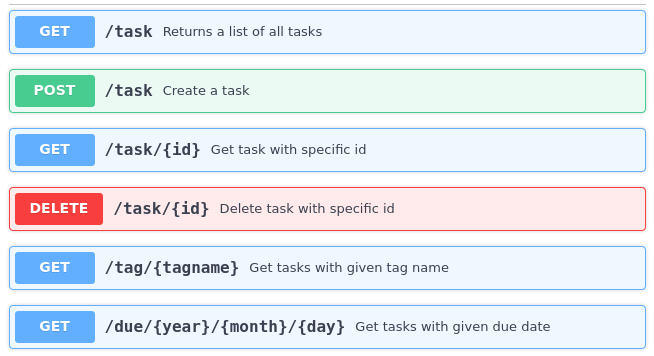

# Using OpenAPI and Swagger

In this part I'll discuss how OpenAPI and Swagger can be used to define REST APIs in a standardized way and how to generate Go code from an OpenAPI specification.

## Motivating problem

In [part 1](./standard-library) of this series - when we were defining the REST API for our application - I noted that the API definition is somewhat ad-hoc, just a list of method/path pairs along with some comments:

```js
POST   /task/              :  create a task, returns ID
GET    /task/<taskid>      :  returns a single task by ID
GET    /task/              :  returns all tasks
DELETE /task/<taskid>      :  delete a task by ID
GET    /tag/<tagname>      :  returns list of tasks with this tag
GET    /due/<yy>/<mm>/<dd> :  returns list of tasks due by this date
```

Wouldn't it be nice it there was some standard way to describe the API? A standard means the description could serve as a contract between servers and clients. Moreover, a standard description would be immediately familiar to folks not intimately involved with the project. It could also be machine-readable, leading to all kinds of automation benefits.

## Swagger and OpenAPI

[Swagger](<https://en.wikipedia.org/wiki/Swagger_(software)>) was initially released in 2011 as an [IDL](https://en.wikipedia.org/wiki/Interface_description_language) for describing REST APIs.

<div align="center">

</div>

The original motivation for Swagger was auto-generating documentation for REST APIs, as well as trying out sample interactions with the API [^1].

The year 2014 saw the release of version 2.0, and in 2016 a bunch of large companies in the industry teamed up to create OpenAPI - a more standardized version of Swagger, with version 3.0.

The official website for all things Swagger and OpenAPI is https://swagger.io, supported by [Smart Bear Software](https://smartbear.com/).

The nomenclature around this is slightly confusing, but the simplest way to remember is that OpenAPI is the current name of the specification, while Swagger typically refers to the tooling around it (though you may also hear "Swagger specification", especially when referring to versions earlier than 3.0).

## Our task service with an OpenAPI definition

Let's start by repeating our favorite exercise of rewriting the task service, this time using OpenAPI and Swagger.

To do this, I spent some time reading the OpenAPI 3.0 documentation and fired up [Swagger Editor](https://editor.swagger.io/) to type in the specification as a YAML file. It took a while, and the final result is [this file](https://github.com/eliben/code-for-blog/blob/master/2021/go-rest-servers/swagger/task.yaml).

For example, the following code snippet is the description of the `GET /task/` request, which is supposed to return all tasks. In an OpenAPI spec we can specify an arbitrary number of _paths_, each with its different methods (GET, POST, etc.) and a description of its parameters and responses, along with JSON schemas.

```yml
/task:
  get:
    summary: Returns a list of all tasks
    responses:
      "200":
        description: A JSON array of task IDs
        content:
          application/json:
            schema:
              type: array
              items:
                $ref: "#/components/schemas/Task"
```

Where `components/schemas/Task` is a reference to this definition of our Task model:

```yml
components:
  schemas:
    Task:
      type: object
      properties:
        id:
          type: integer
        text:
          type: string
        tags:
          type: array
          items:
            type: string
        due:
          type: string
          format: date-time
```

This is a description of a data _schema_; note that we can specify types for data fields, which (in theory, at least) could be helpful in auto-generating validators for this data.

This effort has already produced a benefit - a nice, colorful documentation for our API:

<div align="center">

</div>

This is just a screenshot; the actual documentation is clickable and expandable, providing a clear description of request parameters, responses and their JSON schemas, etc.

There's more, though. Assuming this API is hosted in a publicly-accessible server, we can interact with it straight from the Swagger Editor - just like hand-crafting `curl` commands, but in an auto-generated schema-aware way.

Imagine you've developed this task API and now want to publish it for use in various clients (web, mobile, etc.); if your API is specified with OpenAPI/Swagger, you get automatic documentation and an interface for clients to experiment with the API. This is doubly important when you have API consumers who aren't SW engineers - for example, this could be UX designers, technical documentation writers and product managers who need to understand an API but may be less comfortable throwing scripts together.

Moreover, OpenAPI standardizes things like authorization, which could also be very useful when compared with an ad-hoc description.

There are additional tools available once you have a spec - e.g. [Swagger UI](https://swagger.io/tools/swagger-ui/) and [Swagger Inspector](https://swagger.io/tools/swagger-inspector/). You can even use the spec to help integrate your REST server into your cloud provider's infrastructure; for example, GCP has [Cloud Endpoints for OpenAPI](https://cloud.google.com/endpoints/docs/openapi) for setting up monitoring, analysis and other features for published APIs; the API is described to the tool using OpenAPI.

## Auto-generating a Go server scaffold

The promise of OpenAPI/Swagger goes beyond documentation; we can also generate server and client code from it.

I followed the official instructions of the [Swagger codegen project](https://github.com/swagger-api/swagger-codegen) to generate the skeleton of a Go server. I then filled in the handlers to implement our task server. It's available [here](https://github.com/eliben/code-for-blog/tree/master/2021/go-rest-servers/swagger), with the steps I used written down in the README file in that directory. This server now passes all our automated tests.

The generated code uses `gorilla/mux` for routing (similarly to our approach in part 2) and creates placeholder handlers in a file named `api_default.go`. I've placed the by-now familiar task logic into these handlers; for example:

```go
func TaskIdDelete(w http.ResponseWriter, r *http.Request) {
  id, err := strconv.Atoi(mux.Vars(r)["id"])
  if err != nil {
    http.Error(w, err.Error(), http.StatusBadRequest)
    return
  }
  err = store.DeleteTask(id)
  if err != nil {
    http.Error(w, err.Error(), http.StatusNotFound)
  }
}
```

While working on this, I've collected a few notes on the limitations of this approach:

1. The generated code's package naming / imports didn't work well out of the box, at least not with Go modules. I had to restructure it quite a bit.
2. Some of the generated files didn't comply with `gofmt` formatting for some reason.
3. The code forces globals in the server; whereas in the previous parts we've always had a server struct whose methods were registered as handlers (and therefore the struct instance's fields served as shared data), in the server generated by Swagger the handlers are top-level functions.
4. Even though my OpenAPI definition has a schema forcing integer values on certain path parameters (such as day, month year in the `due/` path), the generated server had no validation for that. Moreover, although `gorilla/mux` supports regexps in path parameters, the generated code didn't even use that. The result: I had to write parameter validation manually again.

Overall, the advantages of auto-generating the server code seem dubious to me. The amount of time it saves is fairly small, considering that I had to rewrite a bunch of the code anyway. Furthermore, since I don't use the generated scaffold as-is, all the saved time only applies the _first time_. If I now change the OpenAPI definition, I can't just ask the code generator to update my server - they've already diverged.

The swagger-codegen tool can also generate _clients_, including for Go. This can be useful in some cases, though I found the client code generated by it somewhat convoluted. As before, it could probably serve as a good starting point for writing your own client, but unlikely to be part of a continuous workflow.

## Trying alternative code generators

OpenAPI specs are written in YAML (or JSON) and have a well-documented format. Therefore, it's hardly surprising that there's more than a single tool available to generate server code from a spec. In the previous section I've covered using the "official" Swagger code generator, but there are many more!

For Go, a popular generator is [go-swagger](https://github.com/go-swagger/go-swagger). Its README has this section:

> **How is this different from go generator in swagger-codegen?**
>
> tl;dr The main difference at this moment is that this one actually works...
>
> The swagger-codegen project only generates a workable go client and even there it will only support flat models. Further, the go server generated by swagger-codegen is mostly a stub.

I tried generating a server with `go-swagger`. Since the code it generates is quite large, I won't link to it; but I'll share my impressions.

First of all, `go-swagger` only supports Swagger spec 2.0, not the newest version 3.0 of OpenAPI. This is rather unfortunate, but I found an [online tool](https://lucybot-inc.github.io/api-spec-converter/) that converts from one to the other, and a version 2.0 of the spec can also be found in [the repository](https://github.com/eliben/code-for-blog/tree/master/2021/go-rest-servers/swagger).

The server generated by `go-swagger` is certainly more feature-ful than the one generated by swagger-codegen, but it comes at a cost. This essentially ties you into the specific framework designed by the `go-swagger` maintainers. The generated code has many dependencies on packages in the https://github.com/go-openapi/ organization, and uses code from these packages extensively to set up and run the server. You even get custom flag parsing packages - because... why not?

If you love the framework used therein, that could be a good thing. But if you have your own ideas in mind - like using Gin or some custom router, it's not very helpful that the generated code is so opinionated.

`go-swagger` can also generate a client for you, which is similarly full featured and opinionated. This may be less of a problem if you need to quickly generate some client code for testing, though.

**Update 2021-02-27**: Following a reader suggestion, I tried yet another code generation tool - [oapi-codegen](https://github.com/deepmap/oapi-codegen), and the task server generated using this tool can be found [here](https://github.com/eliben/code-for-blog/tree/master/2021/go-rest-servers/swagger/oapi-server).

I have to admit I like what `oapi-codegen` is doing much more than the other options tried earlier. The code it generates is simple, clean and easy to split intto the generated part vs. custom code. It even accepts OpenAPI v3! The [only complaint](https://github.com/deepmap/oapi-codegen/issues/303) I have is that it pulls a dependency on a 3rd-party package just to implement binding of request parameters, and this is something I'd prefer to be more configurable; e.g. a setting where I could choose to inline just the right binding code instead of bringing in a dependency.

## Generating specs from code

What if you already have your REST server implemented, but really like the idea of an OpenAPI spec for it; in this case, is it possible to generate a spec from your server code?

Yes! Using special comment annotations and tools like [swaggo/swag](https://github.com/swaggo/swag), the spec (unfortunately only version 2.0, again) will be generated for you. You can then feed this spec into other Swagger tooling for all your documentation needs.

In fact, this seems like a particularly attractive option if you have your own way of writing REST servers and don't want to commit to a new framework just for the purpose of using Swagger.

## Conclusion?

Imagine that you have an application that has to consume a REST API, and there are two services competing for your attention:

1. Service 1 has an ad-hoc description of its API in a text file, with some sample `curl` commands to interact with it.
2. Service 2 has an OpenAPI spec, with nice and standard-looking documentation and tooling to try it out online without having to open the terminal.

Assuming all other parameters are equal, which API would you choose to try out first? IMHO the benefits of OpenAPI for documentation and as a standardized contracts between REST servers and clients is obvious. What's less obvious is the extent to which we should be taking our use of Swagger tooling.

I'd gladly describe my API with OpenAPI and use the documentation tooling, but I'd also be more cautious when it comes to generating code. Personally I'd prefer more control over my server code - what dependencies it has and how it's structured. While I see value in generating server code for quick prototyping and experimentation, I wouldn't use an auto-generated server as the basis of my actual implementation.

In fact, tools like `swaggo/swag` may offer the perfect balance here. You write your server code using whatever framework/technique you like, and add magic comments to describe your REST API. The tool then generates the OpenAPI spec from these comments, and you can generate documentation or anything else from that spec. There's the added benefit of keeping the spec source of truth (the magic comments) as close as possible to the source code implementing it - always a good practice in SW engineering.

## Sources

- https://eli.thegreenplace.net/2021/rest-servers-in-go-part-4-using-openapi-and-swagger

[^1]: Recall the description of [the manual.sh script](https://github.com/eliben/code-for-blog/blob/master/2021/go-rest-servers/testing/manual.sh) from [Part 1](./standard-library). This script contains a collection of curl commands to interact with our server. It's clear that such commands can be auto-generated from a standardized description of the REST API, saving lots of work.
